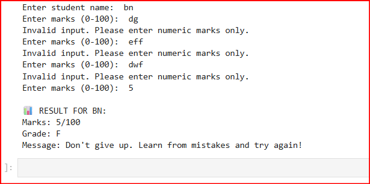
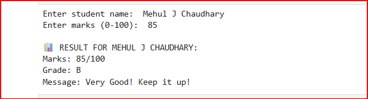

# 🎓 Student Grade Calculator (Python)

## 📌 Project Overview
The **Student Grade Calculator** is a Python-based console application that calculates and displays a student's grade based on entered marks.  
The project focuses on implementing **decision-making, looping, input validation, error handling, and modular programming** using Python.

This project is developed as part of **Week 2 – Making Decisions & Repeating Tasks in Python**, with emphasis on clean logic, robustness, and professional presentation.

---

## 🎯 Project Objectives
- Accept student name and marks from the user
- Validate marks to ensure they fall between 0 and 100
- Handle invalid and non-numeric inputs gracefully
- Assign grades using `if-elif-else` decision logic
- Display encouraging messages based on performance
- Apply modular programming using functions
- Demonstrate real-world console interaction behavior

---

## 🛠️ Technologies Used
- **Python 3.x**
- Jupyter Notebook
- Terminal / Command Prompt
- Visual Studio Code (optional)

---

## 📸 Screenshots

### Invalid Input Handling


### Valid Output Example


---

## ⚙️ Setup Instructions

### Step 1: Install Python
Ensure Python 3 is installed on your system.

Verify installation:
```bash
python --version
